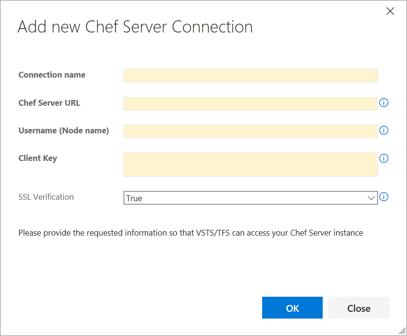

This [Chef](http://chef.io) integration for Visual Studio Team Services provides a set of tasks to automate commonly performed build and release activities against the **[Chef Automate](https://www.chef.io/automate/)** platform.

[Chef Automate](https://www.chef.io/automate/) provides a full suite of enterprise capabilities for workflow, visibility and compliance. Chef Automate integrates with the open-source products Chef, InSpec and Habitat.  You can create your own **Chef Automate** server by launching one from the [Azure Marketplace](https://azuremarketplace.microsoft.com/en-us/marketplace/apps/chef-software.chef-automate?tab=Overview)

These tasks are compatible with Chef Server 12.1 and higher.

---

## Build Tasks

These tasks are typically used in your Build process:

* **Update cookbook version number**: Update a cookbook version to the current build number
* **Upload cookbook to Chef Server**: Upload a cookbook to Chef Server including dependencies

## Release Tasks

These tasks are typically used as part of your Release process:

* **Add variables to Chef Environment**: Add the VSTS/TFS variables for this environment to the Chef environment
* **Release cookbook version to environment**: Releases a cookbook by releasing the cookbook constraint on the specified Chef environment
* **Execute InSpec**: Execute InSpec on machines in a Deployment Group
* **Execute Chef Client**: Execute Chef Client on machines in a Deployment Group

## Configuring your Project

An endpoint called 'Chef Server' is bundled with this extension.  This allows multiple Chef servers to be configured and reused across tasks as required.  Endpoints are a per-project configuration and can be accessed via **Project Settings** (cog) > **Services**

The endpoint securely contains the following information:

* Chef Server URL - URL to the Chef Server including the organization, e.g. `https://mychefserver.westus.cloudapp.azure.com/organizations/myorg`
* Username (Node name) - A username on the Chef server that has admin permissions
* Client key - The private key (in pem format) for the specified user
* SSL Verification - Enables/disables the SSL certificate verification for the Chef Server.  Set to `false` if you are using self-signed certificates.  Default: `true` (Chef Server certificate must be signed by a valid Certificate Authority)

Endpoint configuration can also be accessed during task definition but it is simpler to configure this first, before adding tasks to your build or release pipeline.

## Documentation and help

For details on installation, please read the [installation guide](https://github.com/chef-partners/vsts-chef/wiki).

For detailed task documentation, please read the [task documentation](https://github.com/chef-partners/vsts-chef/wiki).

To report an issue, please check our [issues list](https://github.com/chef-partners/vsts-chef/issues).

## Contributors

This extension was created by Chef Software, Inc.

To get in contact, please email [partnereng@chef.io](partnereng@chef.io)
